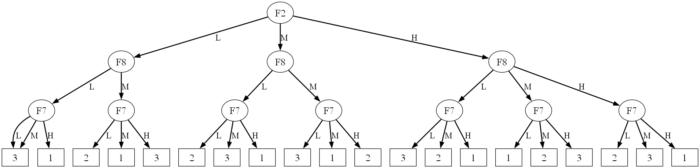

# Fuzzy Tree Plotter

**FuzzyTreePlotter** is a Python class that visualizes fuzzy decision trees from a set of fuzzy logic rules.

## 🚀 Features
- Parses fuzzy logic rules and builds a decision tree.
- Supports both **lists** and **.txt files** as input.
- Case-insensitive parsing (`if`, `is`, `then`, `and`).
- Warnings for empty or unreadable rule files.
- Uses **Graphviz** for visualization.
- Option to aggregate branches with the same outcome.

## 🛠 Requirements

### Python Version:
Python **3.11** or later is recommended.

### Dependencies:
Install required libraries with:

```bash
pip install graphviz
```

## 📦 Usage

### 1️⃣ Import the Class

```python
from fuzzy_tree_plotter import FuzzyTreePlotter
```

---

### 2️⃣ Define Your Fuzzy Rules

You can define rules directly in Python:

```python
rules = [
    "if F2 is L and F8 is L and F7 is L then 3",
    "if F2 is L and F8 is L and F7 is M then 3",
    "if F2 is L and F8 is L and F7 is H then 1",
    "if F2 is L and F8 is M and F7 is L then 2",
    "if F2 is L and F8 is M and F7 is M then 1",
    "if F2 is L and F8 is M and F7 is H then 3",
    "if F2 is M and F8 is L and F7 is L then 2",
    "if F2 is M and F8 is L and F7 is M then 3",
    "if F2 is M and F8 is L and F7 is H then 1",
    "if F2 is M and F8 is M and F7 is L then 3",
    "if F2 is M and F8 is M and F7 is M then 1",
    "if F2 is M and F8 is M and F7 is H then 2",
    "if F2 is H and F8 is L and F7 is L then 3",
    "if F2 is H and F8 is L and F7 is M then 2",
    "if F2 is H and F8 is L and F7 is H then 1",
    "if F2 is H and F8 is M and F7 is L then 1",
    "if F2 is H and F8 is M and F7 is M then 2",
    "if F2 is H and F8 is M and F7 is H then 3",
    "if F2 is H and F8 is H and F7 is L then 2",
    "if F2 is H and F8 is H and F7 is M then 3",
    "if F2 is H and F8 is H and F7 is H then 1",
]
```

Or load them from a `.txt` file:

```python
rules = "rules.txt"  # One rule per line
```

---

### 3️⃣ Create an Instance

```python
plotter = FuzzyTreePlotter(
    rules,
    aggrega=True,
    text_size=20,
    line_width=2,
    edge_text_size=18
)
```

---

### 4️⃣ Render the Tree

```python
plotter.render("fuzzy_tree", format="png", view=True)
```

---

## ⚠️ Notes
- `.txt` files must contain one rule per line with no extra quotes.
- If the file is empty or unreadable, a warning will be printed.


## 📷 Example Output
Here is an example of the fuzzy decision tree generated by the script:


